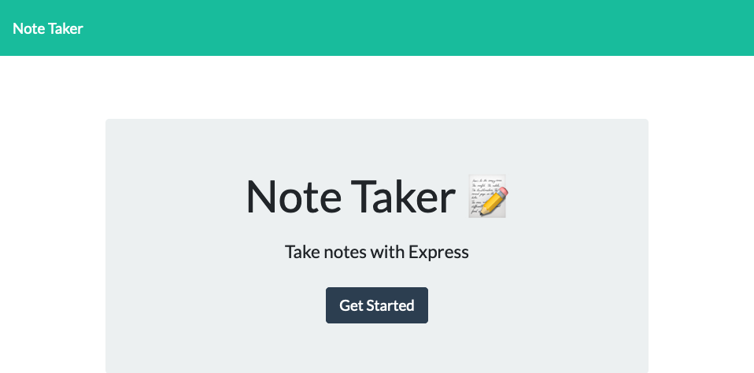
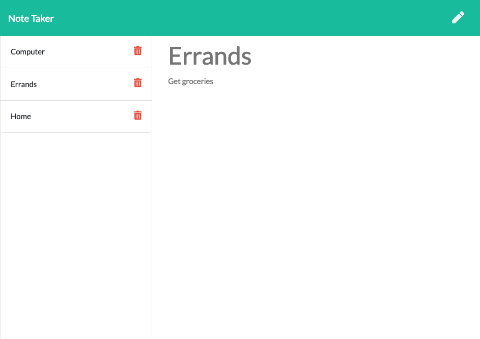

# Note Taker

## Description 
This is a web-application that allows users to enter quick notes, save them and retrieve them. It uses an Express JS as a back-end with notes saving to a JSON db file. It supports reading, saving and deleting notes.

## Table of Contents (Optional)

* [Usage](#usage)
* [Credits](#credits)
* [License](#license)
* [Tests](#tests)

## Usage 
* To install: `npm install`
* To run server in normal mode: `npm run start`
* To run server in watch mode: `npm run watch`

Access web-page here: (https://desolate-springs-35579.herokuapp.com/)

## Credits
* UoT FSF Bcamp - this template

## License

MIT License

## Tests
1. Meets all acceptance criteria in User Story
---
© 2019 Trilogy Education Services, a 2U, Inc. brand. All Rights Reserved.
